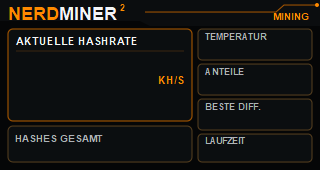
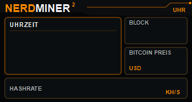
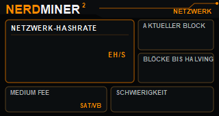
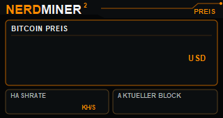
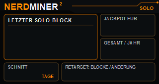
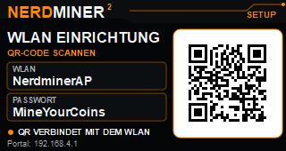

<div align="center">

# BitMiner24 Firmware 2.0

**Solo-Mining-Firmware für den NerdMiner V2 auf LilyGO T-Display S3.**
Komplett neu gebaut auf nativem ESP-IDF 5.5, ohne Arduino-Unterbau.

**~300 kH/s · 52 °C · 38 Host-Tests · OTA mit Rollback**

[**Gerät kaufen auf bitminer24.de →**](https://www.bitminer24.de)



</div>

---

## Was das hier ist

Ein NerdMiner V2 rechnet allein gegen das gesamte Bitcoin-Netzwerk. Die
Gewinnchance ist winzig, der Reiz ist der Lottoschein: Wer trifft, bekommt
den kompletten Block. Diese Firmware ist unsere Antwort auf die Frage, wie
gut so ein Gerät eigentlich laufen kann, wenn man den Unterbau ernst nimmt.

Die Ausgangslage war eine Arduino-Firmware auf einem ESP-IDF von 2020 mit
einem Compiler aus demselben Jahr. Wir haben sie nicht optimiert, sondern
auf dem aktuellen ESP-IDF 5.5 neu aufgebaut und dabei jeden Schritt
gemessen statt geschätzt.

| | vorher | jetzt |
|---|---|---|
| Hashrate | ~78 kH/s | **~300 kH/s** |
| Temperatur | über 60 °C | **52 °C** |
| Unterbau | Arduino, IDF 4.4, GCC 8.4 | ESP-IDF 5.5, GCC 14.2 |
| Tests ohne Hardware | keine | **38** |
| Updates | nur per Kabel | A/B-OTA mit Rollback |
| Korrektheit | ungeprüft | dreistufig verifiziert |

Auf dem Testgerät bestätigt: 40 Stunden Dauerlauf, erster Share vom Pool
angenommen, keine Abstürze.

## Die Bildschirme

| | |
|---|---|
| <br>**Miner** Hashrate, Temperatur, Anteile, beste Difficulty, Laufzeit | <br>**Uhr** Ortszeit, aktueller Block, Bitcoin-Preis |
| <br>**Bitcoin-Netz** globale Hashrate, Halving, Gebühren, Schwierigkeit | <br>**Preis** großer Kurs, Block, Uhrzeit |
| <br>**Solo-Tracker** letzter Solo-Fund weltweit, Jackpot, Statistik | <br>**Einrichtung** WLAN-Portal mit QR-Code |

Seitentaste kurz blättert, vier Sekunden öffnet die Einrichtung, zehn
Sekunden setzt auf Werkszustand zurück. Die zweite Taste schaltet das
Display, Doppelklick dreht es.

## Wie es aufgebaut ist

Alles ist in Module geschnitten, deren reine Logik auf dem PC testbar ist.
Kein Arduino, kein WiFiManager, kein ArduinoJson, kein TFT_eSPI.

```
components/
  bm24_sha/        portable SHA-256-Referenz          getestet gegen NIST + Genesis-Block
  bm24_sha_hw/     das SHA-Werk des ESP32-S3          Boot-Selbsttest + Laufzeitprüfung
  bm24_sha_sw/     ausgerollter Software-Kernel       Vollständigkeit über 800k Nonces bewiesen
  bm24_work/       Coinbase, Merkle, Header, Target   Erwartungswerte unabhängig mit Python erzeugt
  bm24_stratum/    JSON-RPC zum Pool
  bm24_miner/      HW- und SW-Worker, Share-Queue
  bm24_pool/       TCP/TLS, Reconnect, Share-Submit
  bm24_network/    WLAN, Setup-Portal, Dashboard, OTA
  bm24_display/    nativer I80/ST7789-Treiber
  bm24_metrics/    Marktdaten von mempool.space und CoinGecko
  bm24_ui/         fünf Seiten, Tastenauswertung
  bm24_media/      die Bildschirmgrafiken
```

**Nichts verlässt den Miner unverifiziert.** Beim Start prüfen 64 Vektoren
das SHA-Werk gegen die portable Referenz; weicht es ab, wird es abgeschaltet
statt falsch zu rechnen. Jeder Treffer wird vor dem Absenden erneut
nachgerechnet. Ein einziger Fehler schaltet den Hardwarepfad ab.

## Was wir dabei gelernt haben

Die interessanten Ergebnisse waren fast alle negativ, und sie stehen
vollständig mit Zahlen in [`MESSUNGEN.md`](MESSUNGEN.md). Verworfen, weil
gemessen und für nutzlos befunden: ein neuerer Compiler, kalibriertes Warten
statt Warteschleife, die Optimierungsstufen `-O2` und `-Os`, der schnellere
QIO-Flashmodus und der DMA-Modus des SHA-Werks. Letzterer war viermal
langsamer als der direkte Registerzugriff.

Der ESP32-S3 wird beim Mining nicht von der CPU begrenzt, sondern vom Bus
zum SHA-Werk. Wer dort mehr sucht, sucht am falschen Ort.

Was tatsächlich half:

- **Hardware statt Software rechnen lassen.** Das SHA-Werk liefert 270 kH/s
  bei niedrigerer Temperatur als 35 kH/s aus der CPU. Rechenlast auf die
  Kerne zu verlagern ist thermisch der schlechtere Weg.
- **Die Sperre auf das SHA-Werk regelmäßig loslassen.** TLS benutzt denselben
  Baustein. Wer ihn über einen ganzen Job hält, lässt jeden
  Verbindungsaufbau 20 bis 37 Sekunden dauern, bis die Gegenstelle auflegt.
- **Den Miner während Netzabrufen nicht anhalten.** Kostete 8 Prozent
  Hashrate, inklusive Sekunden mit völligem Stillstand.
- **Den Watchdog nur dort einsetzen, wo er hingehört.** Ein Task, der
  regulär minutenlang am Netz wartet, ist kein hängender Task.

## Neu in 2.0

- **Web-Dashboard im Heimnetz.** Live-Werte im Browser, ohne Kabel, ohne
  aufs Display zu schauen. Schreibzugriffe sind passwortgeschützt.
- **Updates über WLAN** mit zwei Partitionen und automatischer Rückkehr zur
  alten Version, falls ein Update nicht startet.
- **Zähler, die einen Stromausfall überleben:** Gesamtlaufzeit, angenommene
  Anteile, beste Difficulty und bestätigte Blockfunde.
- **Absturzdiagnose.** Ein Panic hinterlässt einen auswertbaren
  Speicherauszug statt nur eines stillen Neustarts.
- **Temperaturregelung**, die nur den ineffizienten Softwareanteil drosselt
  und das sparsame Hardwarewerk unangetastet lässt.
- **Captive Portal** mit WLAN-Auswahlliste, Werksreset per langem
  Tastendruck, einstellbare Helligkeit, Farben und Zeitzone.
- Zeitzone mit korrekter Sommerzeitumstellung für Deutschland, Österreich
  und die Schweiz.

## Ideen für die Zukunft

Aufgeschrieben, weil das Fundament sie jetzt hergibt:

- **Signierte Updates.** Das Gerät nimmt nur noch Firmware an, die von
  BitMiner24 unterschrieben wurde.
- **Verschlüsselter Konfigurationsspeicher.** WLAN-Passwort und Adresse
  liegen derzeit im Klartext im Flash.
- **Mehrere Pools mit automatischem Umschalten**, damit ein Pool-Ausfall
  das Gerät nicht stundenlang stillstehen lässt.
- **Gerätename im Netz** statt IP-Adresse.
- **Freiwillige, anonyme Betriebsdaten**, damit sich Ausfälle über viele
  Geräte erkennen lassen statt aus einzelnen Support-Anfragen.
- **Konsole über USB** für die Ferndiagnose, ohne eine Sonderfirmware zu
  bauen.

## Mitmachen

```bash
pio test -e native                                  # 38 Tests, ohne Hardware
pio run -e bm24-v2                                  # Firmware bauen
pio run -e bm24-v2 -t upload --upload-port COM21    # flashen
./tools/measure.sh "meine Variante" 150             # bauen, flashen, messen
```

Details zu Werkzeugen, Ersteinrichtung und dem Weg für eigene Grafiken
stehen in [`MITMACHEN.md`](MITMACHEN.md). Wer eine Optimierung
ausprobieren möchte, sollte vorher [`MESSUNGEN.md`](MESSUNGEN.md) lesen,
damit keine Sackgasse ein zweites Mal gebaut wird.

## Credits

Diese Firmware steht auf den Schultern anderer.

- **[NerdMiner_v2](https://github.com/BitMaker-hub/NerdMiner_v2)** von
  **BitMaker** und der NerdMiner-Gemeinschaft. Von dort stammen die Idee,
  der optimierte Software-SHA-Kernel und die ursprünglichen
  Bildschirmentwürfe. MIT-Lizenz, Copyright (c) 2023 Bitmaker.
- **[Blockstream Jade](https://github.com/Blockstream/Jade)**, auf dessen
  shaLib der Software-Kernel wiederum aufbaut.
- **[@LarryBitcoin](https://github.com/LarryBitcoin)** für die Vorarbeit am
  SHA-Kernel.
- **[Espressif](https://github.com/espressif/esp-idf)** für ESP-IDF.
- **[mempool.space](https://mempool.space)** und
  **[CoinGecko](https://www.coingecko.com)** für die frei zugänglichen
  Netzwerk- und Kursdaten.

Vollständige Herkunftsangaben in [`NOTICE.md`](NOTICE.md), der
Lizenztext des Ursprungsprojekts in [`LICENSE-upstream`](LICENSE-upstream).

---

<div align="center">

### Gerät, Zubehör und Anleitungen

**[www.bitminer24.de](https://www.bitminer24.de)**

Fertig aufgebaute Geräte, Netzteile und deutschsprachiger Support.
Wir liefern aus Deutschland und aktualisieren die Firmware für dich mit.

</div>
